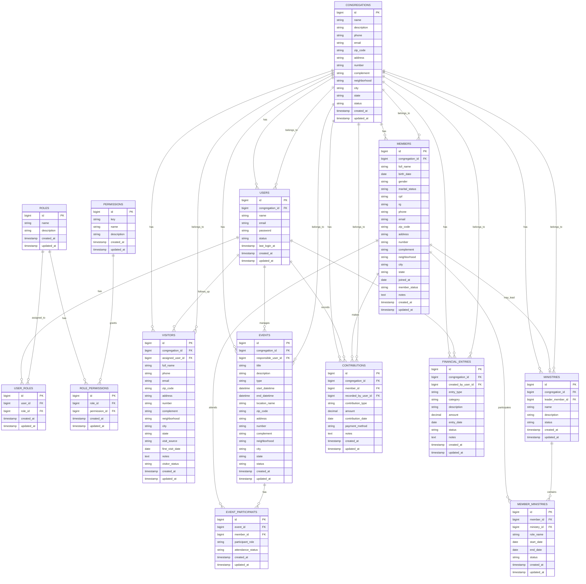

# DER inicial

Diagrama entidade-relacionamento inicial do projeto, em Mermaid, cobrindo o núcleo administrativo do MVP.

```mermaid
erDiagram
    CONGREGATIONS {
        bigint id PK
        string name
        string description
        string phone
        string email
        string zip_code
        string address
        string number
        string complement
        string neighborhood
        string city
        string state
        string status
        timestamp created_at
        timestamp updated_at
    }

    USERS {
        bigint id PK
        bigint congregation_id FK
        string name
        string email
        string password
        string status
        timestamp last_login_at
        timestamp created_at
        timestamp updated_at
    }

    ROLES {
        bigint id PK
        string name
        string description
        timestamp created_at
        timestamp updated_at
    }

    PERMISSIONS {
        bigint id PK
        string key
        string name
        string description
        timestamp created_at
        timestamp updated_at
    }

    USER_ROLES {
        bigint id PK
        bigint user_id FK
        bigint role_id FK
        timestamp created_at
        timestamp updated_at
    }

    ROLE_PERMISSIONS {
        bigint id PK
        bigint role_id FK
        bigint permission_id FK
        timestamp created_at
        timestamp updated_at
    }

    MEMBERS {
        bigint id PK
        bigint congregation_id FK
        string full_name
        date birth_date
        string gender
        string marital_status
        string cpf
        string rg
        string phone
        string email
        string zip_code
        string address
        string number
        string complement
        string neighborhood
        string city
        string state
        date joined_at
        string member_status
        text notes
        timestamp created_at
        timestamp updated_at
    }

    VISITORS {
        bigint id PK
        bigint congregation_id FK
        bigint assigned_user_id FK
        string full_name
        string phone
        string email
        string zip_code
        string address
        string number
        string complement
        string neighborhood
        string city
        string state
        string visit_source
        date first_visit_date
        text notes
        string visitor_status
        timestamp created_at
        timestamp updated_at
    }

    MINISTRIES {
        bigint id PK
        bigint congregation_id FK
        bigint leader_member_id FK
        string name
        string description
        string status
        timestamp created_at
        timestamp updated_at
    }

    MEMBER_MINISTRIES {
        bigint id PK
        bigint member_id FK
        bigint ministry_id FK
        string role_name
        date start_date
        date end_date
        string status
        timestamp created_at
        timestamp updated_at
    }

    EVENTS {
        bigint id PK
        bigint congregation_id FK
        bigint responsible_user_id FK
        string title
        string description
        string type
        datetime start_datetime
        datetime end_datetime
        string location_name
        string zip_code
        string address
        string number
        string complement
        string neighborhood
        string city
        string state
        string status
        timestamp created_at
        timestamp updated_at
    }

    EVENT_PARTICIPANTS {
        bigint id PK
        bigint event_id FK
        bigint member_id FK
        string participant_role
        string attendance_status
        timestamp created_at
        timestamp updated_at
    }

    CONTRIBUTIONS {
        bigint id PK
        bigint congregation_id FK
        bigint member_id FK
        bigint recorded_by_user_id FK
        string contribution_type
        decimal amount
        date contribution_date
        string payment_method
        text notes
        timestamp created_at
        timestamp updated_at
    }

    FINANCIAL_ENTRIES {
        bigint id PK
        bigint congregation_id FK
        bigint created_by_user_id FK
        string entry_type
        string category
        string description
        decimal amount
        date entry_date
        string status
        text notes
        timestamp created_at
        timestamp updated_at
    }

    CONGREGATIONS ||--o{ USERS : has
    CONGREGATIONS ||--o{ MEMBERS : has
    CONGREGATIONS ||--o{ VISITORS : has
    CONGREGATIONS ||--o{ MINISTRIES : has
    CONGREGATIONS ||--o{ EVENTS : has
    CONGREGATIONS ||--o{ CONTRIBUTIONS : has
    CONGREGATIONS ||--o{ FINANCIAL_ENTRIES : has

    USERS ||--o{ USER_ROLES : has
    ROLES ||--o{ USER_ROLES : assigned_to

    ROLES ||--o{ ROLE_PERMISSIONS : has
    PERMISSIONS ||--o{ ROLE_PERMISSIONS : grants

    USERS ||--o{ VISITORS : follows_up
    USERS ||--o{ EVENTS : manages
    USERS ||--o{ CONTRIBUTIONS : records
    USERS ||--o{ FINANCIAL_ENTRIES : creates

    MEMBERS }o--|| CONGREGATIONS : belongs_to
    VISITORS }o--|| CONGREGATIONS : belongs_to
    MINISTRIES }o--|| CONGREGATIONS : belongs_to
    EVENTS }o--|| CONGREGATIONS : belongs_to
    CONTRIBUTIONS }o--|| CONGREGATIONS : belongs_to
    FINANCIAL_ENTRIES }o--|| CONGREGATIONS : belongs_to
    USERS }o--|| CONGREGATIONS : belongs_to

    MEMBERS ||--o{ MEMBER_MINISTRIES : participates
    MINISTRIES ||--o{ MEMBER_MINISTRIES : contains

    MEMBERS ||--o{ EVENT_PARTICIPANTS : attends
    EVENTS ||--o{ EVENT_PARTICIPANTS : has

    MEMBERS ||--o{ CONTRIBUTIONS : makes

    MEMBERS ||--o| MINISTRIES : may_lead
``` 